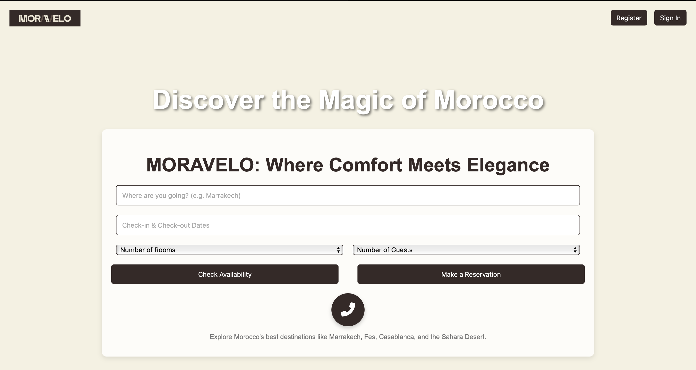
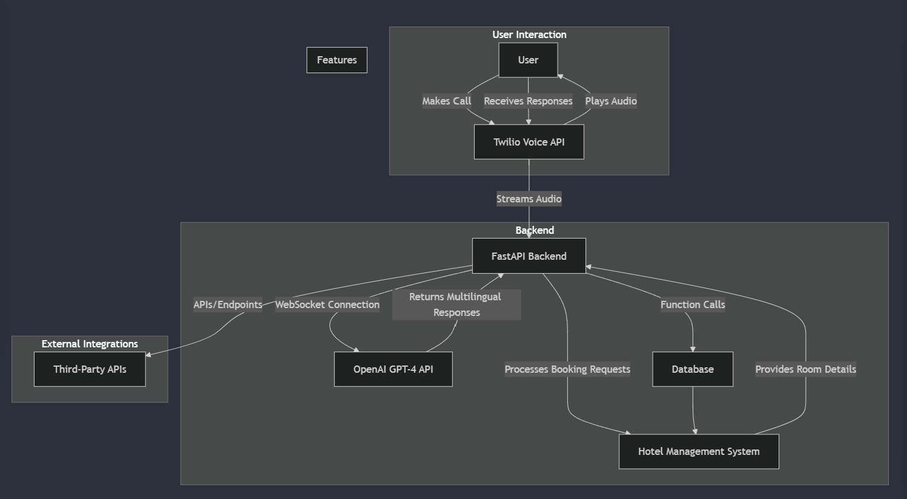
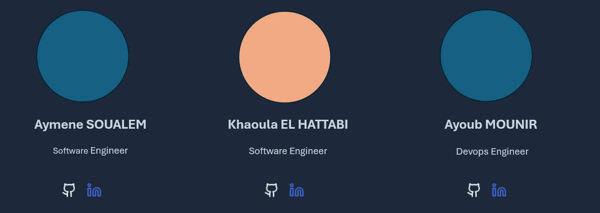

<h1 style="text-align: center;">MORAVELO AI: The Future of Moroccan Hospitality</h1>

<i>Where Innovation Meets Traditional Hospitality</i>

---

## 🌟 The Challenge We're Solving  

Morocco’s tourism sector is entering a transformative era with major international events like CAN 2025 and the 2030 World Cup on the horizon. As the country prepares to host millions of guests from around the world, Moroccan hotels face a pivotal challenge: how to provide seamless, personalized service to an increasingly diverse international clientele while staying true to the warmth and authenticity of Moroccan hospitality.  

### The Story Behind MORAVELO AI  

**MORAVELO AI** is not just a tool but a revolution in hospitality technology. We’ve created a solution built to address the real-world challenges of Morocco's hotel industry. This AI-driven system is designed to bridge the gap between traditional hospitality and modern guest expectations, providing tailored services in real-time.  

---

## 🏗️ Project Architecture: Built for Reality  

### 🔐 Voice Processing Innovation  
We’ve developed an innovative voice processing system that seamlessly integrates the complexity of dialects, languages, and background noise. It ensures that every guest, no matter their language or accent, has a smooth and personalized interaction with the hotel system.  

- **Handling dialectal variations**: From Moroccan Darija to English, French and many other languages, our AI understands and responds to various accents and regional differences.  
- **Noise filtering and voice clarity**: Every interaction is crystal-clear.
- **Multi-channel notifications**: Automated booking confirmations via SMS, email, or voice.  
- **Staff/customer communication**: Real-time notifications for both guests and hotel staff.  

---
### 💡 Innovation Highlights  
- **Real-time voice synthesis and room availability**: Our system processes voice commands in less than 100ms and manage multiple concurrent requests with zero double bookings.  
- **Context-Aware Conversations**: Guests' past interactions and preferences are remembered, creating personalized and meaningful conversations.  

---

### 🎯 Market Impact  

### Immediate Benefits  
- **Reduction in booking time**  
- **Decrease in language-related issues**  
- **Faster response to guest queries**  
- **Improvement in staff efficiency**  

### Long-Term Value  
- Scalable to accommodate major events like CAN 2025 and WC 2030.  
- Continuous system learning and improvement.  

---
## 🛠️ Real-World Implementation  

MORAVELO AI has been designed with real-world hotel environments in mind:  

### Intelligent Booking Flow  🔁
1. **Initial Contact**: Guests begin by interacting with the system in their preferred language, either through voice or text.  
2. **Smart Availability Check**: The system checks real-time room availability.  
3. **Automated Confirmation**: Guests receive instant confirmation through their preferred medium.  
4. **Post-Booking Support**: 24/7 support in multiple languages, ensuring seamless communication even after the booking is made.  
---
### 🌍 Multilingual Excellence  

MORAVELO AI is built to speak your guest’s language:  

- **Arabic**, **French** and **English**: With accent recognition to understand global travelers.  
- **Many other languages**: To support calls from guests and tourists worldwide.

---

### 📞 Call Handling and UI Integration

As part of the <b>MORAVELO AI</b> ecosystem, our system also integrates with a user-friendly interface that manages voice calls seamlessly. When guests initiate contact through voice, the UI routes calls efficiently, ensuring a smooth connection with the AI assistant. This call interface supports multi-language communication, helping guests from around the world to get the support they need in real-time.

---
## 🔧 Technical Architecture  

### 💻 Technologies  
      

---
###  Back End  Overview ⚙️:

**Database Structure:**  
- `hotels`: Stores hotel details  
- `rooms`: Stores room details  
- `bookings`: Stores reservation data  

**Core Scripts:**  
- `populate_db.py`: Initializes and populates the database  
- `main.py`: Manages room availability and booking logic  
- `email_booking.py`: Handles email notifications  
- `webscraper.py`: Fetches area-specific recommendations  

**API Endpoints:**  
- `/available-rooms`: Fetches available rooms  
- `/book-room`: Handles booking requests  
- `/recommendations`: Provides tailored activity recommendations using Tavily API 

---

### Front-End Overview 🌐:

The front-end of the hotel reservation website features a sleek and user-friendly design that allows users to easily browse, search, and book their stay. Key elements include:

Search Form 🔍: Collects details like destination, check-in/check-out dates, room, and guest preferences.

Call Button 📞: A button for quick contact with customer support.

---
## 🎥 Live Demonstration  

---

## 📐 System Architecture  

---
## 🚀 Beyond Hotels: Cross-Sector Applications  

MORAVELO AI is more than just a hotel system; it’s adaptable across various sectors:  

### Healthcare Integration  
- Real-time appointment scheduling with multi-language support.  
- Emergency service coordination, available 24/7.  

### Transportation Hub Support  
- Multi-modal booking for flights, trains, and buses.  
- Real-time travel updates and baggage tracking.  

---
## 👥 Team

---

<i>Join us in shaping the future of Moroccan hospitality.</i>

<i>Developed with passion by the MORAVELO Team ❤️ || Participating in AI Crafters Voic AI Agents Hackathon</i>

<i></i>

